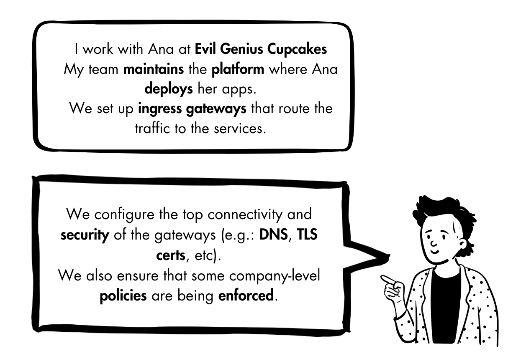

# Speaking Through Policies

Talk for the Cloud Native Barcelona Meetup (March 2025.)

🔗 https://www.meetup.com/cloud-native-bcn/events/306257941/

## Description

In a cloud-native world, platform engineers and application developers each have their own focus areas—security, scalability, reliability, and application logic. But how do they collaborate effectively without stepping on each other’s toes? Gateway Policies provide a structured way to define responsibilities and ensure alignment across teams. This talk explores how policies in Kubernetes—like networking, security, and traffic management—enable separation of concerns while fostering collaboration. We’ll dive into real-world scenarios where policies help teams work together seamlessly, ensuring consistency, compliance, and flexibility in modern cloud environments.

## The demo

The talk develops as a live demo play of the day-to-day interaction between 3 personas involved in the running of service applications on a Kubernetes cluster.

### Know the personas

_(Click on the intro of the persona to impersonate.)_

#### Ana: App Developer

#### Chihiro: Cluster Operator

#### Ian: Infrastructure Provider

Ref.: https://gateway-api.sigs.k8s.io/concepts/roles-and-personas

### Tech

- [Kubernetes](https://kubernetes.io/)
- [Gateway API](https://gateway-api.sigs.k8s.io/)
- [Envoy Gateway](https://gateway.envoyproxy.io/)
- [Kuadrant](https://kuadrant.io/)
- [cert-manager](https://cert-manager.io/)
- [MetalLB](https://metallb.org/)
- [Amazon Route 53 Cloud DNS Service](https://aws.amazon.com/route53/)

### Requisites & Tweaks

To run the demo, you need the following tools installed on your system:

- [Podman](https://podman.io/)
- [Podman Mac Net Connect](https://github.com/jasonmadigan/podman-mac-net-connect) (macOS only)
- [kubectl](https://kubernetes.io/docs/reference/kubectl/introduction/)
- [Kind](https://kind.sigs.k8s.io/)
- [Helm](https://helm.sh/)
- [curl](https://curl.se/)
- [jq](https://jqlang.org/)
- [yq](https://github.com/mikefarah/yq)

You will also need:

- AWS Access key with permission to manage hosted managed zones in Route53

Export the credentials as the `AWS_ACCESS_KEY_ID` and `AWS_SECRET_ACCESS_KEY` shell variables.

The demo uses a public managed zone `demos.kuadrant.io`. Make sure to replace that across all commands with the FQDN associated to your hosted zone.
