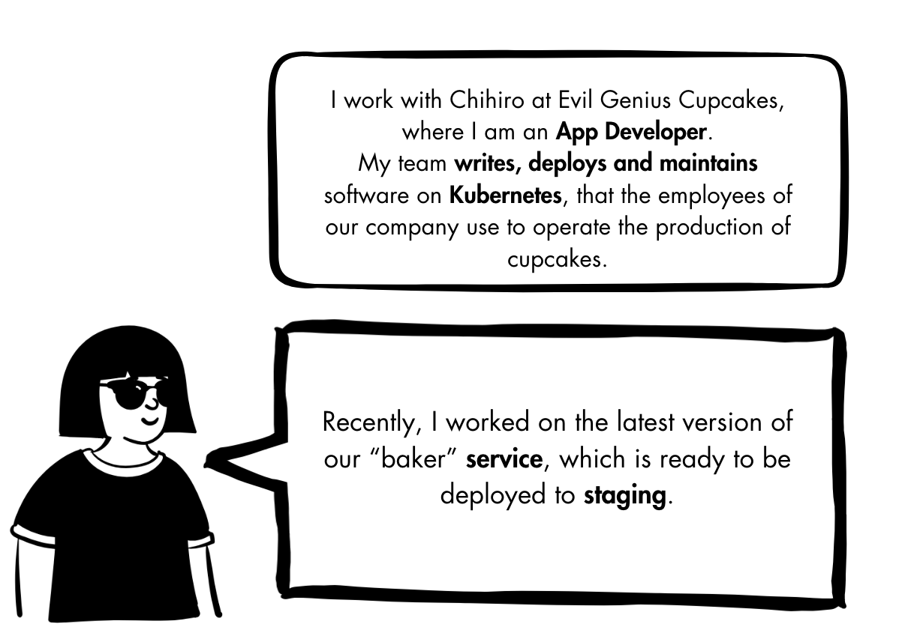

# Ana: App Developer



### Login to the cluster

```sh
ANA_TOKEN=$(pbpaste)

kubectl config set-credentials ana --token=$ANA_TOKEN
kubectl config set-context ana \
  --cluster=arn:aws:eks:eu-north-1:371205855298:cluster/speaking-through-policies \
  --user=ana \
  --namespace=bakery-apps
alias kubectl="kubectl --context=ana"
```

### Deploy the baker app

```sh
kubectl apply -f - <<EOF
apiVersion: apps/v1
kind: Deployment
metadata:
  name: baker
spec:
  selector:
    matchLabels:
      app: baker
  template:
    metadata:
      labels:
        app: baker
    spec:
      containers:
      - name: baker-app
        image: quay.io/kuadrant/authorino-examples:baker-app
        imagePullPolicy: IfNotPresent
        ports:
        - containerPort: 8000
  replicas: 1
---
apiVersion: v1
kind: Service
metadata:
  name: baker
spec:
  selector:
    app: baker
  ports:
    - port: 8000
      protocol: TCP
EOF
```

### Test the baker app within the cluster

```sh
kubectl run curl --attach --rm --restart=Never -q --image=curlimages/curl --image-pull-policy=IfNotPresent -- http://baker:8000/baker -s
```

<br/>
<br/>
<br/>

### Check status of the gateway

```sh
kubectl get gateway/bakery-apps -n ingress-gateways -o jsonpath='{.status.conditions[?(.type=="Programmed")].status}'
# True%
```

### Attach a route to the gateway

```sh
kubectl apply -f - <<EOF
apiVersion: gateway.networking.k8s.io/v1
kind: HTTPRoute
metadata:
  name: baker-route
spec:
  parentRefs:
  - kind: Gateway
    name: bakery-apps
    namespace: ingress-gateways
  rules:
  - matches:
    - path:
        value: /baker
    backendRefs:
    - kind: Service
      name: baker
      port: 8000
EOF
```

### Check the status of the route affected by a DNSPolicy

```sh
kubectl get httproute/baker-route \
  -o jsonpath='{.status.parents[?(.controllerName=="kuadrant.io/policy-controller")]}' | jq

# {
#   "conditions": [
#     {
#       "lastTransitionTime": "2025-03-19T11:35:43Z",
#       "message": "Object affected by DNSPolicy [ingress-gateways/bakery-dns]",
#       "observedGeneration": 1,
#       "reason": "Accepted",
#       "status": "True",
#       "type": "kuadrant.io/DNSPolicyAffected"
#     }
#   ],
#   "controllerName": "kuadrant.io/policy-controller", …
# }
```

### Check the spec of the gateway

```sh
kubectl get gateway/bakery-apps -n ingress-gateways -o yaml | yq
```

### Test the baker app through the gateway

In the browser:

Open http://cupcakes.demos.kuadrant.io/baker in a browser

In the terminal:

```sh
curl http://cupcakes.demos.kuadrant.io/baker
# 200
```

<br/>
<br/>
<br/>

### Test the baker app after TLS configured

```sh
curl http://cupcakes.demos.kuadrant.io/baker --connect-timeout 5
# curl: (7) Failed to connect to cupcakes.demos.kuadrant.io port 80 after 7116 ms: Couldn't connect to server
```

### Check the status of the route affected by a TLSPolicy

```sh
kubectl get httproute/baker-route \
  -o jsonpath='{.status.parents[?(.controllerName=="kuadrant.io/policy-controller")]}' | jq

# {
#   "conditions": [
#     {
#       "lastTransitionTime": "2025-03-19T10:44:19Z",
#       "message": "Object affected by TLSPolicy [ingress-gateways/bakery-tls]",
#       "observedGeneration": 1,
#       "reason": "Accepted",
#       "status": "True",
#       "type": "kuadrant.io/TLSPolicyAffected"
#     }, …
#   ],
#   "controllerName": "kuadrant.io/policy-controller", …
# }
```

### Test the baker app hitting the HTTPS endpoint

```sh
curl https://cupcakes.demos.kuadrant.io/baker
# curl: (60) SSL certificate problem: unable to get local issuer certificate
# More details here: https://curl.se/docs/sslcerts.html
#
# curl failed to verify the legitimacy of the server and therefore could not
# establish a secure connection to it. To learn more about this situation and
# how to fix it, please visit the web page mentioned above.
```

### Bypass self-signed certificate verification by the client

```sh
curl https://cupcakes.demos.kuadrant.io/baker --insecure
# 200
```

<br/>
<br/>
<br/>

### Test the baker app behind the deny-all default auth policy

```sh
curl https://cupcakes.demos.kuadrant.io/baker --insecure
# {
#   "error": "Forbidden",
#   "message": "Access denied by default by the gateway operator. If you are the administrator of the service, create a specific auth policy for the route."
# }
```

### Check the status of the route affected by an AuthPolicy

```sh
kubectl get httproute/baker-route \
  -o jsonpath='{.status.parents[?(.controllerName=="kuadrant.io/policy-controller")]}' | jq

# {
#   "conditions": [
#     {
#       "lastTransitionTime": "2025-03-19T10:46:26Z",
#       "message": "Object affected by AuthPolicy [ingress-gateways/deny-all]",
#       "observedGeneration": 1,
#       "reason": "Accepted",
#       "status": "True",
#       "type": "kuadrant.io/AuthPolicyAffected"
#     }, …
#   ],
#   "controllerName": "kuadrant.io/policy-controller", …
# }
```

### Define an OIDCPolicy to replace the default deny-all one

```sh
kubectl apply -f -<<EOF
apiVersion: kuadrant.io/v1alpha1
kind: OIDCPolicy
metadata:
  name: baker-oidc
spec:
  targetRef:
    group: gateway.networking.k8s.io
    kind: HTTPRoute
    name: baker-route
  provider:
    issuerURL: "https://gitlab.com"
    clientID: "c0b3a4e52c5e60ccb40ccf7c9bd63828476cde4b71910beb463897069ce1ae29"
  auth:
    claims:
      groups_direct: "evil-genius-cupcakes"
EOF
```

Check the status of the policy:

```sh
kubectl get oidcpolicy/baker-oidc -o yaml | yq
```

### Test the baker app impersonating an external user

1. Open https://cupcakes.demos.kuadrant.io/baker in a browser<br/>
   _(The browser will redirect to the auth server's login page.)_

2. Log in with a valid Gitlab user who is a member of the 'evil-genius-cupcakes' group.<br/>
   _(The auth server will redirect to the page of the baker app originally requested.)_


### Define another AuthPolicy to extend access to pods

```sh
kubectl apply -f -<<EOF
apiVersion: kuadrant.io/v1
kind: AuthPolicy
metadata:
  name: baker-pods
spec:
  targetRef:
    group: gateway.networking.k8s.io
    kind: HTTPRoute
    name: baker-route
  overrides:
    strategy: merge
    rules:
      authentication:
        "pods": # east-west
          kubernetesTokenReview:
            audiences:
            - https://kubernetes.default.svc.cluster.local
            - https://kubernetes.default.svc
          overrides:
            "iss":
              value: https://kubernetes.default.svc.cluster.local
          priority: 0
      authorization:
        "pods":
          when:
          - predicate: auth.identity.iss == "https://kubernetes.default.svc.cluster.local"
          patternMatching:
            patterns:
            - predicate: auth.identity.user.username.split(":")[2] == "bakery-apps" && request.method == "GET"
EOF
```

Check the status of the policy:

```sh
kubectl get authpolicy/baker-pods -o yaml | yq
```

### Test the baker app impersonating another pod running within the cluster

#### Create a Service Account to identify another pod 'toppings'

```sh
kubectl apply -f -<<EOF
apiVersion: v1
kind: ServiceAccount
metadata:
  name: toppings
EOF
```

#### Send an authenticated request to the baker app

```sh
export POD_SA_TOKEN=$(kubectl create token toppings)
curl -H "Authorization: Bearer $POD_SA_TOKEN" https://cupcakes.demos.kuadrant.io/baker/api --insecure
# 200
```

#### Try to access a forbidden endpoint of the baker app

```sh
export POD_SA_TOKEN=$(kubectl create token toppings)
curl -H "Authorization: Bearer $POD_SA_TOKEN" https://cupcakes.demos.kuadrant.io/baker/api --insecure -X POST -i
# HTTP/2 403
# x-ext-auth-reason: Unauthorized
```

### Define a Rate Limit Policy for the baker app for a maximum of 5rp10s

```sh
kubectl apply -f -<<EOF
apiVersion: kuadrant.io/v1
kind: RateLimitPolicy
metadata:
  name: baker-rate-limit
spec:
  targetRef:
    group: gateway.networking.k8s.io
    kind: HTTPRoute
    name: baker-route
  limits:
    global:
      rates:
      - limit: 5
        window: 10s
EOF
```

### Check the status of the route affected by a RateLimitPolicy

```sh
kubectl get httproute/baker-route \
  -o jsonpath='{.status.parents[?(.controllerName=="kuadrant.io/policy-controller")]}' | jq

# {
#   "conditions": [
#     {
#       "lastTransitionTime": "2025-03-19T10:51:48Z",
#       "message": "Object affected by RateLimitPolicy [bakery-apps/baker-rate-limit]",
#       "observedGeneration": 1,
#       "reason": "Accepted",
#       "status": "True",
#       "type": "kuadrant.io/RateLimitPolicyAffected"
#     }, …
#   ],
#   "controllerName": "kuadrant.io/policy-controller", …
# }
```

### Check the status of the RateLimitPolicy

```sh
kubectl get ratelimitpolicy/baker-rate-limit -o yaml | yq
```

### Send a few requests to the baker app

```sh
while :; do curl -H "Authorization: Bearer $POD_SA_TOKEN" https://cupcakes.demos.kuadrant.io/baker/api --insecure -s --output /dev/null --write-out '%{http_code}\n' | grep -E --color "\b(429)\b|$"; sleep 1; done
# 200
# 200
# 200
# 200
# 200
# 429
# 429
# 429
# 429
# 429
# 200
# 200
```

<br/>
<br/>
<br/>

### Check the status of the route affected by another RateLimitPolicy

```sh
kubectl get httproute/baker-route \
  -o jsonpath='{.status.parents[?(.controllerName=="kuadrant.io/policy-controller")]}' | jq

# {
#   "conditions": [
#     {
#       "lastTransitionTime": "2025-03-19T10:51:48Z",
#       "message": "Object affected by RateLimitPolicy [bakery-apps/baker-rate-limit ingress-gateways/gateway-rate-limit]",
#       "observedGeneration": 1,
#       "reason": "Accepted",
#       "status": "True",
#       "type": "kuadrant.io/RateLimitPolicyAffected"
#     }, …
#   ],
#   "controllerName": "kuadrant.io/policy-controller", …
# }
```

### Check the status of the baker RateLimitPolicy overridden by the more restrictive policy

```sh
kubectl get ratelimitpolicy/baker-rate-limit -o jsonpath='{.status.conditions[?(.type=="Enforced")]}' | jq
# {
#   "lastTransitionTime": "2025-03-19T11:09:17Z",
#   "message": "RateLimitPolicy is overridden by [ingress-gateways/gateway-rate-limit]",
#   "reason": "Overridden",
#   "status": "False",
#   "type": "Enforced"
# }
```

### Send a few requests to the baker app

```sh
while :; do curl -H "Authorization: Bearer $POD_SA_TOKEN" https://cupcakes.demos.kuadrant.io/baker/api --insecure -s --output /dev/null --write-out '%{http_code}\n' | grep -E --color "\b(429)\b|$"; sleep 1; done
# 200
# 200
# 429
# 429
# 429
# 429
# 429
# 429
# 429
# 429
# 200
# 200
```
